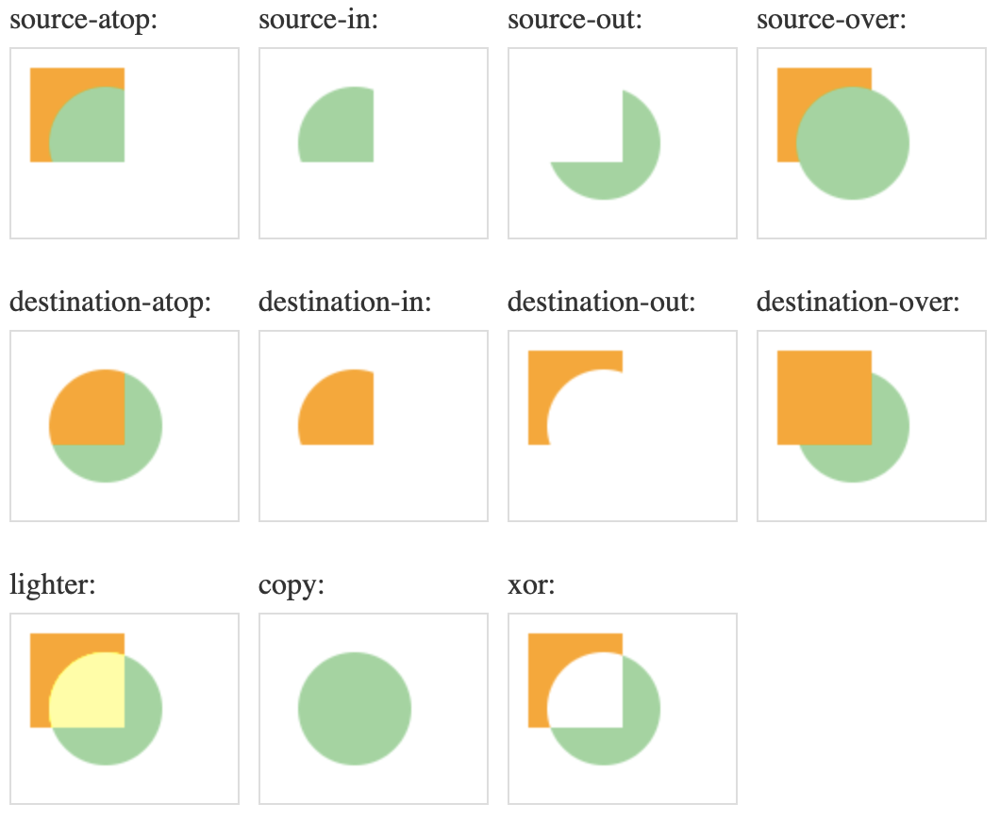

### 合成

#### 透明度合成 globalAlpha

-   什么是 globalAlpha？

    globalAlpha 就是全局对象的透明度，全局对象就是 canvas 的上下文对象。
    使用方法：ctx.globalAlpha=0.6;

#### 路径裁剪 clip()

-   什么是路径裁剪？

    路径裁剪就是在画布上设置一个路径，让我们之后绘制的图像只显示在这个路径之中。
    路径裁剪的步骤：

    1. 定义路径
    2. ctx.clip()
    3. 绘制其他图形

#### 什么是全局合成？

-   全局合成是 canvas 画布中的现有图像和即将绘制的图像的融合方式。
    我们可以从形状和色彩两方面解读全局合成。
    比如下图：

    -   先画一个黄色的正方形
    -   设置全局合成的属性 globalCompositeOperation，默认值 source-cover
    -   再绘制一个绿色的圆

    

#### 总结

已绘制到 canvas 上的图像不可被修改，只能被覆盖或擦除。

-   路局裁剪是基于路径的一种合成方式，它只能使用路径设置裁剪区域，如果是文字的话，就无效，基于一个路径，即使路径没有画出来。
-   透明度合成和全局合成都是基于像素的操作，必须画一个，再再此基础上进行合成
