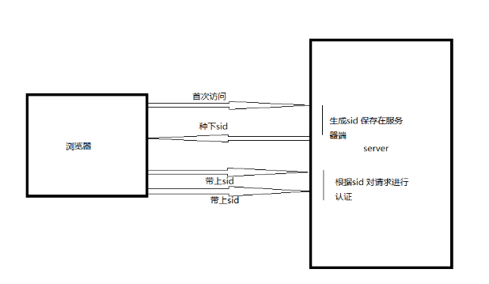
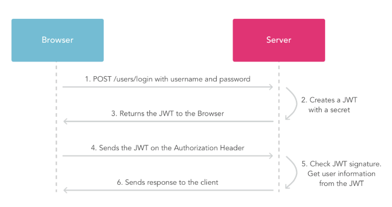

## session 的原理

session 会话机制是⼀种服务器端机制，它使⽤类似于哈希表（可能还有哈希表）的结构来保存信
息。

实现原理：

1. 服务器在接受客户端⾸次访问时在服务器端创建 seesion，然后保存 seesion(我们可以将
   seesion 保存在内存中，也可以保存在 redis 中，推荐使⽤后者)，然后给这个 session ⽣成⼀
   个唯⼀的标识字符串,然后在响应头中种下这个唯⼀标识字符串。
2. 签名。这⼀步通过秘钥对 sid 进⾏签名处理，避免客户端修改 sid。（⾮必需步骤）
3. 浏览器中收到请求响应的时候会解析响应头，然后将 sid 保存在本地 cookie 中，浏览器在下次
   http 请求的请求头中会带上该域名下的 cookie 信息，
4. 服务器在接受客户端请求时会去解析请求头 cookie 中的 sid，然后根据这个 sid 去找服务器端
   保存的该客户端的 session，然后判断该请求是否合法。

### 使⽤ redis 存储 session

redis 介绍

-   是⼀个⾼性能的 key-value 数据库。

#### Redis 与其他 key - value 缓存产品有以下三个特点：

-   Redis ⽀持数据的持久化，可以将内存中的数据保存在磁盘中，重启的时候可以再次加载进⾏使⽤。
-   Redis 不仅仅⽀持简单的 key-value 类型的数据，同时还提供 list，set，zset，hash 等数据结构
    的存储。
-   Redis ⽀持数据的备份，即 master-slave 模式的数据备份。

##### Redis 优势

-   性能极⾼ – Redis 能读的速度是 110000 次/s,写的速度是 81000 次/s 。
-   丰富的数据类型 – Redis ⽀持⼆进制案例的 Strings, Lists, Hashes, Sets 及 Ordered
    Sets 数据类型操作。
-   原⼦ – Redis 的所有操作都是原⼦性的，意思就是要么成功执⾏要么失败完全不执⾏。单个操作是原
    ⼦性的。多个操作也⽀持事务，即原⼦性，通过 MULTI 和 EXEC 指令包起来。
-   丰富的特性 – Redis 还⽀持 publish/subscribe, 通知, key 过期等等特性。

## Token 验证

1.  客户端使⽤⽤户名跟密码请求登录
2.  服务端收到请求，去验证⽤户名与密码
3.  验证成功后，服务端会签发⼀个令牌(Token)，再把这个 Token 发送给客户端
4.  客户端收到 Token 以后可以把它存储起来，⽐如放在 Cookie ⾥或者 Local Storage
    ⾥
5.  客户端每次向服务端请求资源的时候需要带着服务端签发的 Token
6.  服务端收到请求，然后去验证客户端请求⾥⾯带着的 Token，如果验证成功，就向客户端返回请求的数据

## 与 Token 简单对⽐

-   session 要求服务端存储信息，并且根据 id 能够检索，⽽ token 不需要（因为信息就在 token
    中，这样实现了服务端⽆状态化）。在⼤规模系统中，对每个请求都检索会话信息可能是⼀
    个复杂和耗时的过程。但另外⼀⽅⾯服务端要通过 token 来解析⽤户身份也需要定义好相应
    的协议（⽐如 JWT）。
-   session ⼀般通过 cookie 来交互，⽽ token ⽅式更加灵活，可以是 cookie，也可以是 header，也可以放在请求的内容中。不使⽤ cookie 可以带来跨域上的便利性
-   token 的⽣成⽅式更加多样化，可以由第三⽅模块来提供
-   token 若被盗⽤，服务端⽆法感知，cookie 信息存储在⽤户⾃⼰电脑中，被盗⽤⻛险略⼩

## JWT(JSON WEB TOKEN)原理解析

1. Bearer Token 包含三个组成部分：令牌头、payload、哈希

    - 签名：默认使⽤ base64 对令牌头，payload 编码。使⽤ hs256 算法对令牌头、payload 和密钥进⾏签名⽣成哈希
    - 验证：默认使⽤ hs256 算法对 hs256 算法对令牌中数据签名并将结果和令牌中哈希⽐对

## OAuth(开放授权)

概述：三⽅登⼊主要基于 OAuth 2.0。OAuth 协议为⽤户资源的授权提供了⼀个安全的、开放⽽⼜简易的标准。与以往的授权⽅式不同之处是 OAUTH 的授权不会使第三⽅触及到⽤户的帐号信息
（如⽤户名与密码），即第三⽅⽆需使⽤⽤户的⽤户名与密码就可以申请获得该⽤户资源的授权，
因此 OAUTH 是安全的.
