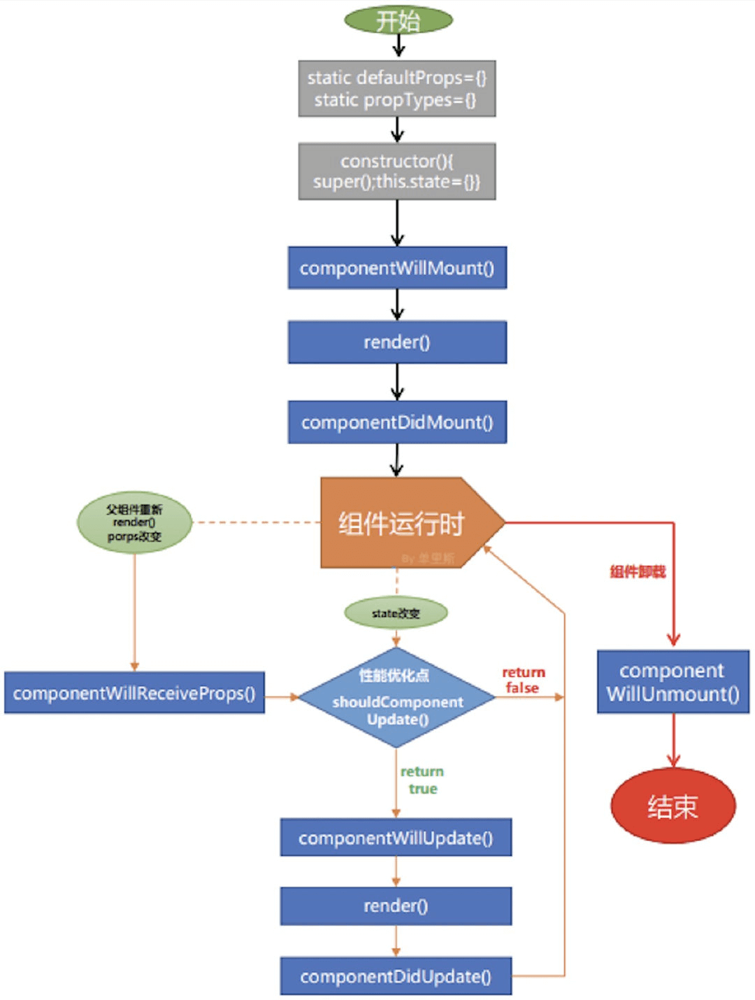
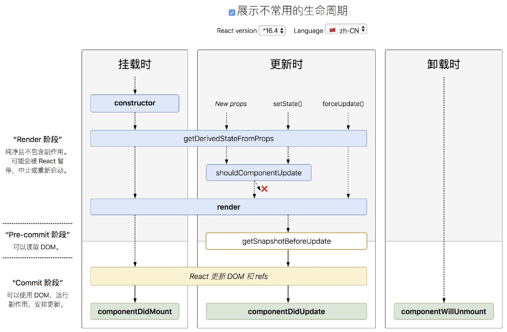
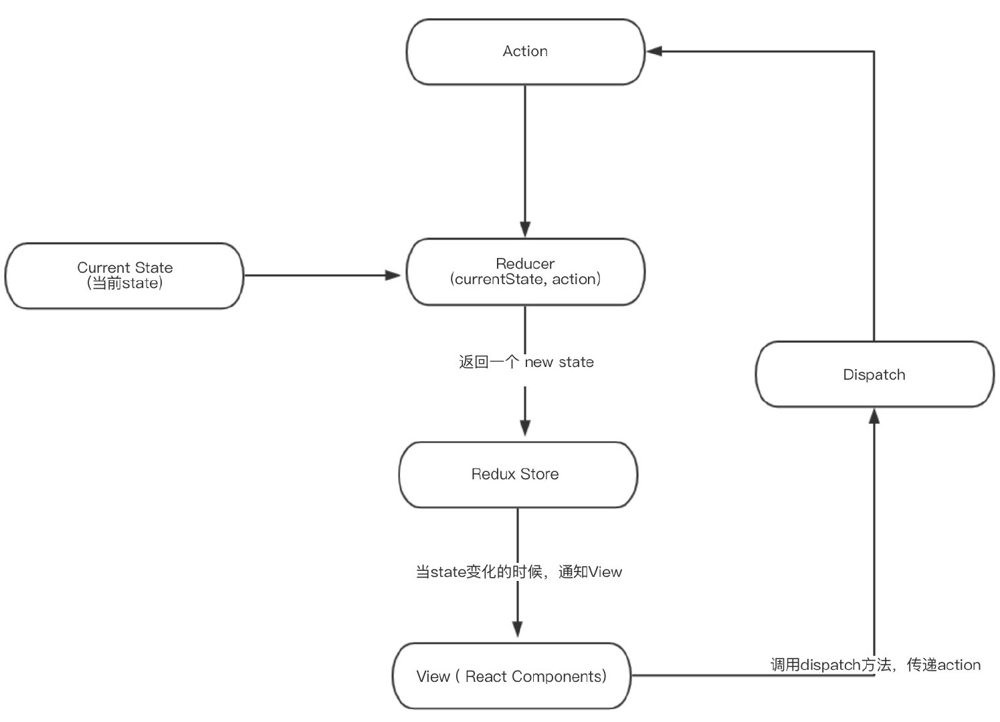

# 入门

### 起步

1. 创建项⽬（cra）： npx create-react-app my-app
2. 打开项⽬： cd my-app
3. 启动项⽬： npm start
4. 暴露配置项： npm run eject

### React 和 ReactDom

- React 负责逻辑控制，数据 -> VDOM
- ReactDom 渲染实际 DOM，VDOM -> DOM
- React 使⽤ JSX 来描述 UI
- babel-loader 把 JSX 编译成相应的 JS 对象，React.createElement 再把这个 JS 对象构造成 React 需
  要的虚拟 dom。

# JSX 语法

### JSX

- JSX 是⼀种 JavaScript 的语法扩展，其格式⽐较像模版语⾔，但事实上完全是在 JavaScript 内部实现的。
- JSX 可以很好地描述 UI，能够有效提⾼开发效率。

### 基本使用

- 表达式{}的使⽤，index.js

  ```jsx
  const name = "react study";
  const jsx = <div>hello, {name}</div>;
  ```

- 函数也是合法表达式，index.js

  ```jsx
  const obj = {
   x fistName: "Harry",
    lastName: "Potter",
  };
  function formatName(name) {
    return name.fistName + " " + name.lastName;
  }
  const jsx = <div>{formatName(user)}</div>;
  ```

- jsx 是 js 对象，也是合法表达式，index.js
  ```jsx
  const greet = <div>good</div>;
  const jsx = <div>{greet}</div>;
  ```
- 条件语句可以基于上⾯结论实现，index.js
  ```jsx
  const show = true; //false;
  const greet = <div>good</div>;
  const jsx = (
    <div>
      {/* 条件语句 */}
      {show ? greet : "登录"}
      {show && greet}
    </div>
  );
  ```
- 数组会被作为⼀组⼦元素对待，数组中存放⼀组 jsx 可⽤于显示列表数据
  ```jsx
  const a = [0, 1, 2];
  const jsx = (
    <div>
      {/* 数组 */}
      <ul>
        {/* diff时候，⾸先⽐较type，然后是key，所以同级同类型元素，key值必须得 唯⼀ */}
        {a.map((item) => (
          <li key={item}>{item}</li>
        ))}
      </ul>
    </div>
  );
  ```

### 属性使用

```jsx
import logo from "./logo.svg";
const jsx = (
  <div>
    {/* 属性：静态值⽤双引号，动态值⽤花括号；class、for等要特殊处理。 */}
    
  </div>
);
```

### 模块化 [链接](http://www.ruanyifeng.com/blog/2016/06/css_modules.html)

- css 模块化，创建 index.module.css，index.js

  ```jsx
  import style from "./index.module.css";
  ;
  ```

- 或者 npm install sass -D

  ```jsx
  import style from "./index.module.scss";
  ;
  ```

# 组件

组件，从概念上类似于 JavaScript 函数。它接受任意的⼊参（即 “props”），并返回⽤于描述⻚⾯展示
内容的 React 元素。
组件有两种形式：class 组件和 function 组件。

### class 组件

- class 组件通常拥有状态和⽣命周期，继承于 Component，实现 render ⽅法。

### function 组件

- 函数组件通常⽆状态，仅关注内容展示，返回渲染结果即可。
- 从 React16.8 开始引⼊了 hooks，函数组件也能够拥有状态。
- 提示: 如果你熟悉 React class 的⽣命周期函数，你可以把 useEffect Hook 看做
  componentDidMount ， componentDidUpdate 和 componentWillUnmount 这三个函数的组合。

# 正确使⽤ setState

- 不要直接修改 State
- State 的更新可能是异步的： setState 只有在合成事件和⽣命周期函数中是异步的，在原⽣事件和 setTimeout 中都是同步
  的，这⾥的异步其实是批量更新。
- State 的更新会被合并，如果想要链式更新 state：

  ```js
  //合并
  changeValue = (v) => {
    this.setState({
      counter: this.state.counter + v,
    });
  };
  setCounter = () => {
    this.changeValue(1);
    this.changeValue(2);
  };
  // 链式
  changeValue = (v) => {
    this.setState((state) => ({ counter: state.counter + v }));
  };
  setCounter = () => {
    this.changeValue(1);
    this.changeValue(2);
  };
  ```

# 生命周期

- React V16.3 之前的⽣命周期
  
- V16.4 之后的⽣命周期
  

  V17 可能会废弃的三个⽣命周期函数⽤`getDerivedStateFromProps`替代，⽬前使⽤的话加上 UNSAFE\_：

  - componentWillMount
  - componentWillReceiveProps
  - componentWillUpdate

  引⼊两个新的⽣命周期函数：

  - static getDerivedStateFromProps
  - getSnapshotBeforeUpdate
    如果不想⼿动给将要废弃的⽣命周期添加 UNSAFE\_ 前缀，可以⽤下⾯的命令。

        ```
        npx react-codemod rename-unsafe-lifecycles <path>
        ```

  新引⼊的两个⽣命周期函数

  - getDerivedStateFromProps
    ```
    static getDerivedStateFromProps(props, state)
    ```
    getDerivedStateFromProps 会在调⽤ render ⽅法之前调⽤，并且在初始挂载及后续更新时都会被调⽤。它应返回⼀个对象来更新 state，如果返回 null 则不更新任何内容。
    **请注意**，不管原因是什么，都会在每次渲染前触发此⽅法。这与`UNSAFE_componentWillReceiveProps` 形成对⽐，后者仅在⽗组件重新渲染时触发，⽽不是在内部调⽤ setState 时
  - getSnapshotBeforeUpdate
    ```
    getSnapshotBeforeUpdate(prevProps, prevState)
    ```
    在 render 之后，在 componentDidUpdate 之前。
    `getSnapshotBeforeUpdate()` 在最近⼀次渲染输出（提交到 DOM 节点）之前调⽤。它使得组件能
    在发⽣更改之前从 DOM 中捕获⼀些信息（例如，滚动位置）。此⽣命周期的任何返回值将作为参数传递给 componentDidUpdate(prevProps, prevState, snapshot) 。

# Redux

### 你可能不需要 redux

Redux 是负责组织 state 的⼯具，但你也要考虑它是否适合你的情况。不要因为有⼈告诉你要⽤ Redux 就去⽤，花点时间好好想想使⽤了 Redux 会带来的好处或坏处。在下⾯的场景中，引⼊ Redux 是⽐较明智的：

- 你有着相当⼤量的、随时间变化的数据；
- 你的 state 需要有⼀个单⼀可靠数据来源；
- 你觉得把所有 state 放在最顶层组件中已经⽆法满⾜需要了。
- 某个组件的状态需要共享。

### redux

redux 是 JavaScript 应⽤的状态容器，提供可预测化的状态管理。它保证程序⾏为⼀致性且易于测试。


### 检查点

1. createStore 创建 store
2. reducer 初始化、修改状态函数
3. getState 获取状态值
4. dispatch 提交更新
5. subscribe 变更订阅

### 使⽤ react-redux

react-redux 提供了两个 api:

1. Provider 为后代组件提供 store
2. connect 为组件提供数据和变更⽅法

# React-router

### react-router

react-router 包含 3 个库：

- react-router：提供最基本的路由功能，实际使⽤不会直接安装
- react-router-dom：在浏览器中使⽤
- react-router-native：在 rn 中使⽤

### Route 渲染内容的三种⽅式

Route 渲染优先级：children>component>render。
这三种⽅式互斥，你只能⽤⼀种。

- children：func
  不管 location 是否匹配，都需要渲染⼀些内容时，⽤ children。除了不管 location 是否匹配都会被渲染之外，其它⼯作⽅法与 render 完全⼀样。
- render：func 只在当 location 匹配的时候渲染。
- component: component 只在当 location 匹配的时候渲染

### PureComponent

React.PureComponent 与 React.Component 很相似。

- 区别：React.Component 未实现 shouldComponentUpdate() ，⽽ React.PureComponent 中以浅层对⽐ prop 和 state 的⽅式来实现了该函数。

- 注意：
  1. React.PureComponent 中的 shouldComponentUpdate() 仅作对象的浅⽐较。如果对象
     包含复杂的数据结构，则有可能因为⽆法检查深层的差别，产⽣错误的⽐对结果。
  2. 仅在你的 props 和 state 较为简单时，才使⽤ React.PureComponent ，或者在深层数据结构发⽣变化时
     调⽤ forceUpdate() 来确保组件被正确地更新。
  3. 也可以使⽤ immutable 对象加速嵌套数据的⽐较。
  4. 此外， React.PureComponent 中的 shouldComponentUpdate() 将跳过所有⼦组件树的 prop
     更新。因此，请确保所有⼦组件也都是“纯”的组件。

# Hook

### 认识 Hook

- **Hook 是什么？** Hook 是⼀个特殊的函数，它可以让你“钩⼊” React 的特性。例如， useState 是允许你在 React 函数组件中添加 state 的 Hook。
- **什么时候我会⽤ Hook？** 函数组件需要向其添加⼀些 state，使⽤ Hook。

### 使⽤ Effect Hook

Effect Hook 可以让你在函数组件中执⾏副作⽤操作。赋值给 `useEffect` 的函数会在组件渲染到屏幕之后执⾏。（数据获取，设置订阅以及⼿动更改 React 组件中的 DOM 都属于副作⽤。）

- **effect 的条件执⾏** 给 `useEffect` 传递第⼆个参数，它是 effect 所依赖的值数组。只有当 `useEffect` 第⼆个参数数组⾥的数值 改变后才会重新创建订阅

- **清除 effect** `useEffect` 函数返回清除函数，以防⽌内存泄漏，该函数会在组件卸载前执⾏。

### 自定义 Hook

⾃定义 Hook 是⼀个函数，其名称以 “use” 开头，函数内部可以调⽤其他的 Hook。

### Hook 使⽤规则

Hook 就是 JavaScript 函数，但是使⽤它们会有两个额外的规则：

- 只能在函数最外层调⽤ Hook。不要在循环、条件判断或者⼦函数中调⽤。
- 只能在 React 的函数组件中调⽤ Hook。不要在其他 JavaScript 函数中调⽤。（还有⼀个地⽅可以调⽤ Hook —— 就是⾃定义的 Hook 中。）

### useMemo

把“创建”函数和依赖项数组作为参数传⼊ useMemo ，它仅会在某个依赖项改变时才重新计算 memoized 值。这种优化有助于避免在每次渲染时都进⾏⾼开销的计算。

```js
const [count, setCount] = useState(0);
const expensive = useMemo(() => {
  console.log("compute");
  let sum = 0;
  for (let i = 0; i < count; i++) {
    sum += i;
  }
  return sum;
  //只有count变化，这⾥才重新执⾏
}, [count]);
```

### useCallback

把内联回调函数及依赖项数组作为参数传⼊ useCallback ，它将返回该回调函数的 memoized 版本，该回调函数仅在某个依赖项改变时才会更新。

```js
const [count, setCount] = useState(0);
const addClick = useCallback(() => {
  let sum = 0;
  for (let i = 0; i < count; i++) {
    sum += i;
  }
  return sum;
}, [count]);
```
useCallback(fn, deps) 相当于 useMemo(() => fn, deps) 。